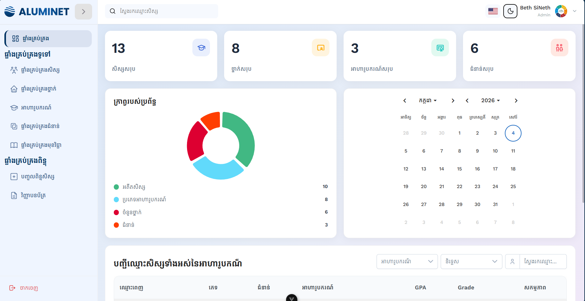
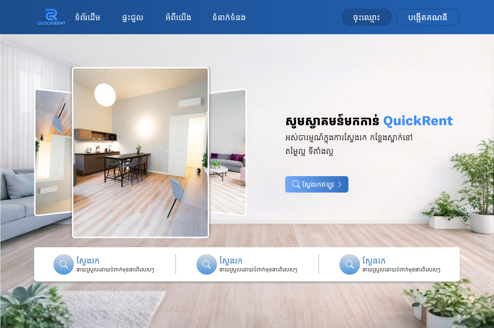

<!-- Header Section -->

  <!-- <h1>👋 Hi, I'm SiNeth Beth</h1> -->
  <h3>🚀 Full Stack Developer | Building Modern Web Applications

  
  
  
  
  
  

---

## 💡 About Me

I'm a passionate **Full Stack Developer** with hands-on experience in building web applications using modern technologies. Strong foundation in frontend and backend development, with a commitment to continuous learning and problem-solving. Awarded a scholarship from **the Ministry of Post and Telecommunications of Cambodia (MPTC)** and **the S.A Foundation** to pursue intensive training at **ANT Training Center**, where I strengthened my technical and collaborative skills.

**Key Strengths:**
- 🎨 Frontend Design & Development with modern frameworks
- ⚙️ Backend Architecture & API Development
- 💾 Database Design & Optimization
- 🔧 Full-stack problem solving
- 📚 Clean code & best practices

---

## 🛠️ Tech Stack

### Frontend

### Backend

### Database

### Tools & Others

---

## 📌 Featured Projects

### 🏆 Project 1: Aluminet [ ANT End Course Node.js Express.js ]

<table>
<tr>
<td width="70%">

**🎯 Goal:** Develop a digital alumni management system that streamlines the management of alumni records, academic results, scholarships, classes, and certificate generation, while improving efficiency, data accuracy, security, and reducing manual administrative work.

**⚙️ Tech Stack:**
- Frontend: Vue.js 3, Bootstrap, Primevue, Axios
- Backend: Node.js, Express.js
- Database: MySQL
- Authentication: JWT

**🚩 My Role:**
Full Stack Developer.

**✅ Responsibility:**

* ✨ Collaborated with team members to design and implement the MySQL database schema.
* ✨ Developed RESTful APIs using Node.js and Express.js for the Student Dashboard module.
* ✨ Built responsive and reusable UI components using Vue.js.
* ✨ Integrated frontend applications with backend APIs and managed data flow.
* ✨ **Implemented secure profile photo storage and image optimization using Cloudinary.**
* ✨ Participated in the software development lifecycle, including planning, development, and testing.

</td>
<td width="30%">

**Video Demo:**
[Link to short video](https://youtube.com)

</td>
</tr>
</table>

---

### 🏠 Project 2: Quick Rent [ ANT End Course JavaScript Vue.js ]

<table>
<tr>
<td width="70%">

**🎯 Goal:**
Create a modern property rental platform that streamlines the process of finding, listing, and managing rental properties with an intuitive user experience.

**⚙️ Tech Stack:** Vue.js 3, JavaScript, Tailwind CSS, REST API Integration.

**🚩 My Role:**
Front end Developer.

**✅ Responsibility:**

* ✨ Developed the Landing Page, Rent Page, Wishlist Page, and Room Detail Page using **Vue.js**.
* ✨ Integrated frontend components with backend APIs to display and manage dynamic data.
* ✨ Built responsive and user-friendly interfaces to ensure a seamless user experience across devices.
* ✨ Collaborated with team members to implement features and maintain application consistency.
* ✨ Structured and maintained reusable components for better scalability and maintainability.

</td>
<td width="30%">

  
  

**Video Demo:**
[Link to short video](https://youtu.be/7B55RbpYM60?si=XgUu_lqsgDhy-bKE)

</td>
</tr>
</table>

---

## 📊 GitHub Analytics

### 🔥 Streak Stats

---

## 🐍 Contribution Snake Animation

---

## 🌱 Currently Learning

-  Advanced Nuxt.js Patterns
-  TypeScript Best Practices
-  NoSQL Databases
- 🏗️ System Design & Architecture

---

## 📊 Activity

---

## 🤝 Let's Connect!

I'm always interested in collaborating on exciting projects and connecting with fellow developers. Feel free to reach out!

- 💼 **LinkedIn:** [LinkedIn](https://www.linkedin.com/in/sineth-beth-637576378)
- 🌐 **Portfolio:** [Portfolio](https://portfolio-sineth.vercel.app)
- 💬 **Facebook:** [Facebook](https://web.facebook.com/sinet.bet.7)
- 📧 **Email:** mailto:bethsineth7898@gmail.com
- 📞 **Phone:** +855-1560-7393

---

### ⭐ If you like my work, feel free to star my repositories!

**Made with ❤️ by SiNeth Beth**

